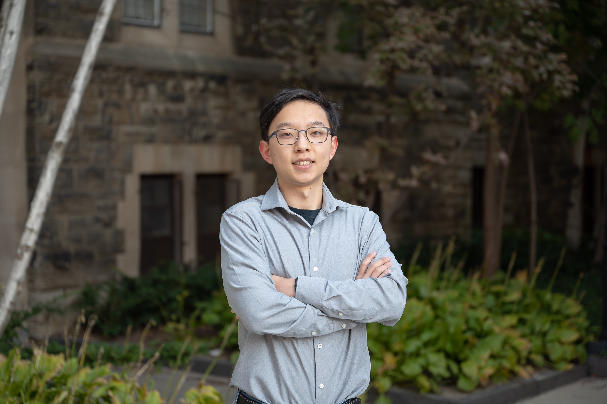

# Welcome
I am not a web developer. My website will be ugly. 

I graduated in May 2023 from Engineering Science (physics specialization) from the University of Toronto. I took the least amount of physics courses possible, and cherry-picked the ECE courses that I liked.

I will be pursing a Master's degree in Electrical Engineering and Information Technology at ETH Zurich (2023 - 2025).

My current interests are:
1. VLSI, semiconductor physics, wireless systems, electromagnetics
2. computational methods (ex. simulating the above interests)
3. embedded systems (ex. microcontrollers and FPGAs, so I'm employable in the short-term)

## Links
[CV](files/cv_liyongda.pdf) \
[undergraduate thesis](files/liyongda_final_thesis_report.pdf) \
[food](https://photos.app.goo.gl/CGwjosAJovxjep1J6)

## Obligatory professional photo

[a fun photo](images/toronto.jpg)

## Contact
main: `yongdali314 at gmail.com` \
school: `yongli at ethz.ch`
