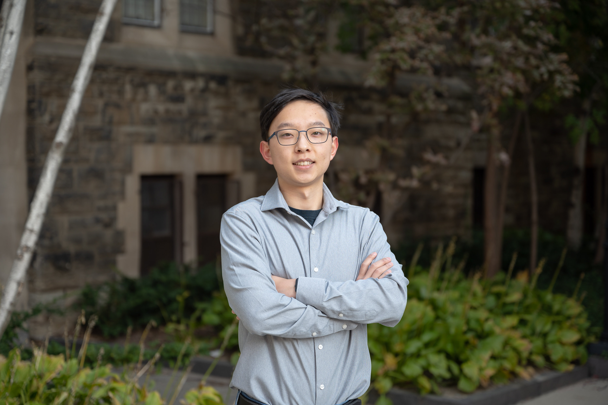

# Welcome
I am not a web developer. My website will be simple. 

## Current work
I am a master's student in electrical engineering and information technology at ETH Zurich. As of February 2026, I am working on my master's thesis with the [nano-tcad](https://nano-tcad.ee.ethz.ch/) group. The group produces a quantum transport simulator called [Quatrex](https://github.com/quatrex/quatrex/tree/dev). It implements the non-equilibrium Green's function (NEGF) formalism with a self-consistent GW approximation to account for electron-electron effects. My topic is to adapt the simulator to use an adaptive non-uniform energy grid, with the purpose of saving memory while maintaining accuracy. The difficulty lies in performing a Fourier transform on non-equally spaced points, since many symmetries are lost due to the non-uniformity. I expect to graduate in May 2026.

I am experienced in classical semiconductor transport (ex. drift-diffusion, energy-balance model, hydrodynamic model) using the discontinuous Galerkin finite element method. For a previous project, we were able to produce simulation results that reasonably matched commercially available simulators in Sentaurus TCAD and Silvaco ATLAS.

## Previous school and work
Before specializing in semiconductor modelling, I graduated in May 2023 from Engineering Science (physics specialization) from the University of Toronto. I took the least amount of physics courses possible, and cherry-picked the electrical engineering courses that I liked. Some of the cool highlights:
- designing, fabbing, and testing an impedance matching circuit for a microstrip antenna at 1GHz
- producing YBCO superconductors, measuring their quenching temperature, and powder x-ray diffraction to characterize their structure
- designed a 720p HDMI-in to 1080p HDMI-out video upscaler at 60fps on Xilinx Artix-y FPGA

At Altera (2021-2023, formerly Intel), I worked on the software program management team for Altera's structured ASIC business. I coordinated bug priority, timelines, and budgets with cross-functional teams. I also created the initial version of the software development plan for a [next-generation product](https://community.altera.com/blog/fpga-blog/intel-and-darpa-announce-sahara-program-to-develop-secure-reliable-domestic-sour/244721). As I was leaving, I trained 4 full-time new-hires and 3 interns onto the team. During my 4th year of undergrad, I switched to part-time work at Intel as a CI/CD software engineer on the [Intel Simics simulator for Altera FPGAs](https://www.altera.com/products/development-tools/simics-virtual-platform).

I also have a few random "jack of all trades, master of none" skills from various projects and design team experiences:
- high-frequency microwave circuit design (KeySight ADS)
- digital circuit design (Cadence Virtuoso)
- STM32 firmware development
- FPGA development (Quartus, Vivado)
- PCB schematic and layout (Altium, Eagle)

When I'm not working, you can find me playing [ultimate frisbee](images/ultimate.jpg), [volleyball](images/volleyball.jpeg), or [hiking](images/hiking.jpg).

## Links

| topic | details |
|-------|---------|
| [Google Scholar](https://scholar.google.com/citations?hl=en&user=0ZKenDkAAAAJ) | no publications within my research field, only conference papers associated with the CubeSat team at the University of Toronto |
| [CV](files/cv_liyongda.pdf) | summer 2023 |
| [undergraduate thesis](files/liyongda_final_thesis_report.pdf) | computational electromagnetics supervised by Prof. Piero Triverio |
| [food](https://photos.app.goo.gl/CGwjosAJovxjep1J6) | I am an avid cook |

## Obligatory professional photo

[a fun photo](images/toronto.jpg)

## Contact
main: `yongdali314 at gmail.com` \
school: `yongli at ethz.ch`
